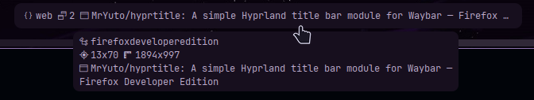

# Hyprtitle

A simple Hyprland title bar module for Waybar.




## Features

- Active workspace details
  - name
  - Windows count
- Active window details
  - Title
  - Class
  - Size
  - Position
  - Pinned
  - Floating
- Copy to clipboard using `wl-copy`

## Installation

Compile using `cargo build --release`, or download the binary from the [releases](https://github.com/MrYuto/hyprtitle/releases/latest) page.

## Waybar config

```json
  "custom/hyprtitle": {
    "max-length": 50, // Optional max length to avoid long title
    "tooltip": true,
    "exec": "/path/to/hyprtitle/hyprtitle",
    "return-type": "json",
    "on-click": "/path/to/hyprtitle copy --class",
    "on-click-right": "/path/to/hyprtitle copy --title"
  }
```

## Copy to clipboard usage

```sh
hyprtitle copy [OPTIONS]

Options:
  -t, --title
  -c, --class
  -s, --size
  -p, --position
  -h, --help
```
